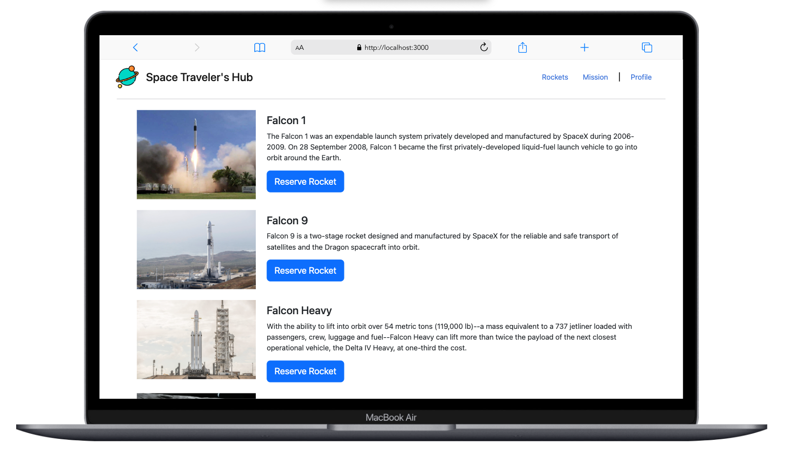

<a name="readme-top"></a>

<div align="center">

  <br/>

  <h1><b>Space Traveler's Hub</b></h1>

</div>

<!-- TABLE OF CONTENTS -->

# 📗 Table of Contents

- [📖 About the Project](#about-project)
  - [🛠 Built With](#built-with)
    - [Tech Stack](#tech-stack)
    - [Key Features](#key-features)
- [💻 Getting Started](#getting-started)
  - [Setup](#setup)
  - [Prerequisites](#prerequisites)
  - [Usage](#usage)
  - [Run tests](#run-tests)
- [👥 Authors](#authors)
- [🔭 Future Features](#future-features)
- [🤝 Contributing](#contributing)
- [⭐️ Show your support](#support)
- [🙏 Acknowledgements](#acknowledgements)
- [📝 License](#license)

<!-- PROJECT DESCRIPTION -->

# 📖 [Space Traveler's Hub] <a name="about-project"></a>

**[Soace Traveler's Hub]** is an application to reserve rockets and book mission to the universe.

## 🛠 Built With <a name="built-with"></a>

### Tech Stack <a name="tech-stack"></a>

<details>
  <summary>React</summary>
  <ul>
    <li><a href="https://reactjs.org/">React.js</a></li>
  </ul>
</details>

<details>
  <summary>Rudex</summary>
  <ul>
    <li><a href="">Express.js</a></li>
  </ul>
</details>

<details>
<summary>SCSS and CSS</summary>
  <ul>
    <li><a href="">PostgreSQL</a></li>
  </ul>
</details>

<!-- Features -->

### Key Features <a name="key-features"></a>

- **[Reserve rockets]**
- **[Become a member of a mission]**
- **[Create a profile]**

<p align="right">(<a href="#readme-top">back to top</a>)</p>

<!-- LIVE DEMO -->

<!-- 
<-- ## 🚀 Live Demo <a name="live-demo"></a>

- [Live Demo Link](https://google.com)

<p align="right">(<a href="#readme-top">back to top</a>)</p> -->

<!-- GETTING STARTED -->

## 💻 Getting Started <a name="getting-started"></a>

To get a local copy up and running, follow these steps.

### Prerequisites

In order to run this project you need:

Node package

Example command:

```
 npm install
```


### Setup

Clone this repository to your desired folder:

```
  cd my-folder
  git clone https://github.com/Tracy-miranja/space-travelers-hub.git
```

### Usage

To run the project, execute the following command:

```
  npm start
```

### Run tests

To run tests, run the following command:

```
  npm run test
```

<p align="right">(<a href="#readme-top">back to top</a>)</p>

<!-- AUTHORS -->

## 👥 Authors <a name="authors"></a>

👤 **Tracy Miranja**

- GitHub: [@Tracy Miranja](https://github.com/Tracy-miranja)
- Twitter: [@twitterhandle](https://twitter.com/twitterhandle)
- LinkedIn: [LinkedIn](https://linkedin.com/in/linkedinhandle)

👤 **SamTush**

- GitHub: [@SamTush](https://github.com/SamTush)
- Twitter: [@twitterhandle](https://twitter.com/twitterhandle)
- LinkedIn: [LinkedIn](https://linkedin.com/in/linkedinhandle)

<p align="right">(<a href="#readme-top">back to top</a>)</p>

<!-- FUTURE FEATURES -->

## 🔭 Future Features <a name="future-features"></a>

- [ ] **[Add a database to save user data]**

<p align="right">(<a href="#readme-top">back to top</a>)</p>

<!-- CONTRIBUTING -->

## 🤝 Contributing <a name="contributing"></a>

Contributions, issues, and feature requests are welcome!

Feel free to check the [issues page](https://github.com/Tracy-miranja/space-travelers-hub/issues).

<p align="right">(<a href="#readme-top">back to top</a>)</p>

<!-- SUPPORT -->

## ⭐️ Show your support <a name="support"></a>

If you like this project, feel free to support and conteibute.

<p align="right">(<a href="#readme-top">back to top</a>)</p>

<!-- ACKNOWLEDGEMENTS -->

## 🙏 Acknowledgments <a name="acknowledgements"></a>

I would like to thank the contributors of this project, Microverse and anyone seeing this project.

<p align="right">(<a href="#readme-top">back to top</a>)</p>

<!-- LICENSE -->

## 📝 License <a name="license"></a>

This project is [MIT](https://github.com/Tracy-miranja/space-travelers-hub/blob/feature/setup/LICENCE) licensed.

<p align="right">(<a href="#readme-top">back to top</a>)</p>
